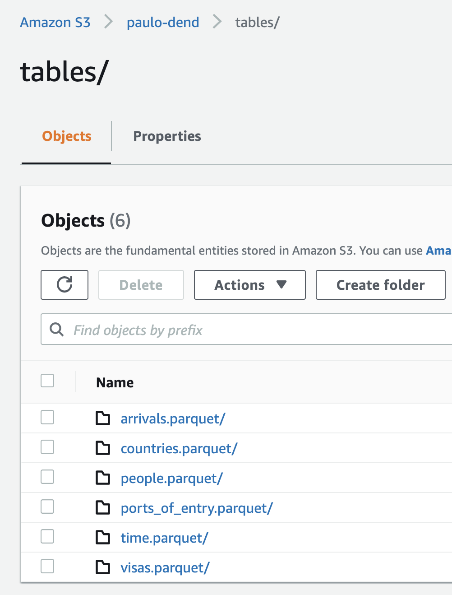

# Capstone Project - US Immigration Data

## Introduction

The United States are one of the top destinations for travelers
and immigrants from all over the world. Every day, millions of
people arrive at the country's ports, either by land, sea or air.
The US government provides data about immigration movements
and make it available for those who are willing to pay for it.
The I94 datasets provide datasets about people coming in
and out, where do they come from, which port of entry they use,
what visa they present and many other pieces of information.

This project focuses on building an ETL pipeline that loads
raw immigration data from S3, processes them using Spark,
and save the processed data back into S3 using the star schema
paradigm with a fact table and several dimension tables.
This will allow further analytics activities in order to continue
get insights regarding immigration in the United States.

## The Model



The ETL process starts by loading the raw data files from S3 into
an EMR cluster running Spark. After the initial load is complete, the
script does some data wrangling using PySpark and generates six parquet-based
tables which form the final data model. The model consists of one fact
table and five dimension tables. All tables are detailed in the next sections.

### Fact table: `arrivals`

This fact table holds data about individual entries into the United States by
air, land or sea.

Fields:
* id
* person_id (FK)
* visa_code (FK)
* country_of_origin (FK)
* port_of_entry (FK)
* date (FK)
* airline
* flight_number
* allowed_until_date
* visa_issuer

### Dimension table: `people`

This dimension table holds data about individual travelers (non-PII).

Fields:
* admission_number
* birth_year
* gender
* address_state

### Dimension table: `visas`

This dimension table holds data about the visas used by the travelers and
immigrants to entry into US territory.

Fields:
* code
* purpose

### Dimension table: `countries`

This dimension table holds data about the countries of origin from travelers.

Fields:
* i94_code
* name

### Dimension table: `ports_of_entry`

This dimension table holds data about the different ports of entry used by
immigrants to entry into the US by air, land or sea. It is worth mentioning
that these are not airport IATA codes.

Fields:
* code
* name
* state

### Dimension table: `time`

This dimension table holds data about the dates of entry from travelers.

Fields:
* arrdate
* day
* weekday
* month
* year

## Directory structure

This project consists of the files listed below.

```
capstone_project/
├── README.md
├── dl.cfg
├── etl.py
├── data/
```
* `README.md`: This README file
* `dl.cfg`: Configuration file for AWS credentials to be placed
* `etl.py`: Python script consisting of the ETL pipeline
* `etl_notebook.ipynb`: Jupyter notebook for testing and prototyping of the ETL
* `data/`: Directory containing some sample data for local testing

## ETL pipeline usage

The ETL pipeline processes the raw data stored in S3 and populates the abovementioned tables.
The raw data consist of several JSON-based files placed in the S3 bucket.

### Requirements

- Python 3.7 or above
- PySpark
- AWS EMR cluster up and running with proper configuration

### `etl.py` script usage

The ETL processing happens in the `etl.py` script. It should be submitted to the
cluster as a Spark job using the `spark-submit` command. Details on how to submit
Spark jobs can be found in the Spark and EMR documentation.
