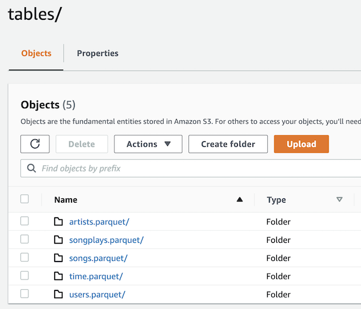

# Sparkify - Data Lake with Spark and AWS

## Introduction

Sparkify is a startup in the segment of music streaming. They have a
very popular app which gives their users access to a large catalog
of songs from artists from all over the world. In order to better
drive business decisions, Sparkify recently started to collect all
sorts of user activity data which should fuel several planned data
analysis and machine learning pipelines.

This project focuses on building an ETL pipeline that extracts
usage data from S3, processes them using Spark, and loads the data
back into S3 as a set of dimensional tables. This will allow the
analytics team to continue finding insights in what songs their
users are listening to.

## The Model



The ETL process starts by loading the raw data files from S3 into
an EMR cluster running Spark. After the initial load is complete, the
script does some data wrangling using PySpark and generates five parquet-based
tables which form the final data model. The model consists of one fact
table and four dimension tables. All tables are detailed in the next sections.

### Fact table: `songplays`

This fact table holds data about songplay events from users of Sparkify's
music app.

Fields:
* id
* start_time
* user_id
* level
* song_id
* artist_id
* session_id
* location
* user_agent

### Dimension table: `songs`

This dimension table holds data about songs available on Sparkify's catalog.

Fields:
* id
* title
* artist_id
* year
* duration

### Dimension table: `artists`

This dimension table holds data about artists availble on Sparkify's catalog.

Fields:
* id
* name
* location
* latitude
* longitude

### Dimension table: `users`

This dimension table holds data about users of Sparkify's music app.

Fields:
* id
* first_name
* last_name
* gender
* level

### Dimension table: `time`

This dimension table keeps track of timestamp information from songplay events.

Fields:
* timestamp
* hour
* day
* week
* month
* year
* weekday

## Directory structure

This project consists of the files listed below.

```
data_lake_spark/
├── README.md
├── dl.cfg
├── etl.py
├── sample_data/
```
* `README.md`: This README file
* `dl.cfg`: Configuration file for AWS credentials to be placed
* `etl.py`: Python script consisting of the ETL pipeline
* `sample_data/`: Directory containing some sample data for local testing

## ETL pipeline usage

The ETL pipeline processes the raw data stored in S3 and populates the abovementioned tables.
The raw data consist of several JSON-based files placed in the S3 bucket.

### Requirements

- Python 3.7 or above
- PySpark
- AWS EMR cluster up and running with proper configuration

### `etl.py` script usage

The ETL processing happens in the `etl.py` script. It should be submitted to the
cluster as a Spark job using the `spark-submit` command. Details on how to submit
Spark jobs can be found in the Spark and EMR documentation.
